# Wake — Agentic and Memory Architecture Ideas

This document is a decision space, not an implementation plan. It presents alternative architectures for Wake's agents, memory, and core AI loop so that the product direction can be reasoned about before code changes begin.

## Current foundation

Wake already has the beginning of a useful vertical pipeline:

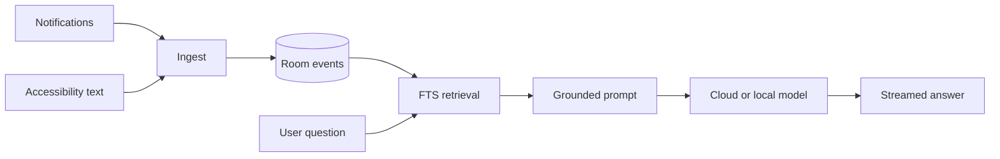

Existing code boundaries already suggest three useful seams:

- Capture and ingestion produce normalized memory events.
- Retrieval selects context independently of the model.
- `LlmEngine` allows cloud and on-device inference to share an answer layer.

The major product choice is whether Wake remains a memory assistant that answers questions, or becomes an agent that notices situations, proposes actions, and safely executes them.

## Core concepts

An agentic Wake can be separated into six concerns:

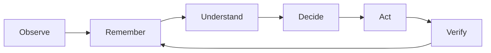

- **Observe:** Capture notifications, visible screen text, app state, and user input.
- **Remember:** Store events and derive useful longer-lived memories.
- **Understand:** Identify entities, tasks, conversations, intent, and current context.
- **Decide:** Determine whether to answer, ask, suggest, wait, or act.
- **Act:** Open an app, prepare text, create a reminder, or invoke an integration.
- **Verify:** Confirm the intended result and record the outcome.

Every architecture below distributes these responsibilities differently.

---

# Agent architectures

## Architecture A — Single orchestrator with tools

One model receives the user request, retrieves memory, decides which tool to call, and produces the final response.

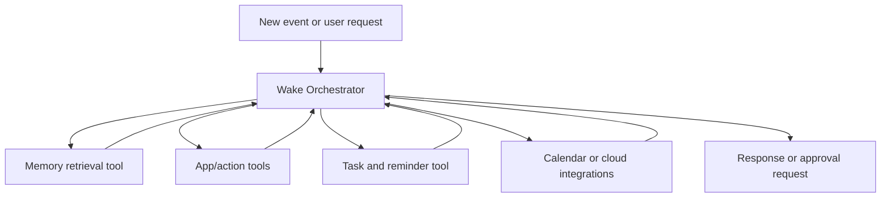

### Core loop

```text
receive input
→ classify intent
→ retrieve memory
→ choose zero or more tools
→ request approval if needed
→ execute
→ verify
→ answer and store outcome
```

### Strengths

- Smallest architecture and easiest to debug.
- Fits the existing `GroundedAnswerer` and `LlmEngine` boundaries.
- One prompt sees the full situation.
- Good first architecture for a demo or MVP.

### Weaknesses

- The orchestrator prompt gradually becomes large and complicated.
- Memory retrieval, planning, safety, and response quality compete in one context.
- A single reasoning error can affect the whole workflow.
- Harder to evaluate individual capabilities independently.

### Best fit

Question answering, simple reminders, drafting replies, opening apps, and a small number of approval-gated actions.

---

## Architecture B — Router with specialist agents

A lightweight router selects one specialist. The specialist owns the workflow and returns a result to the user.

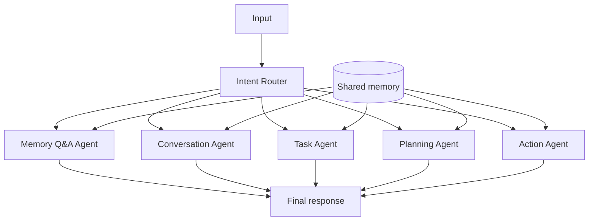

Possible specialists:

- **Memory Q&A Agent:** Answers grounded questions about captured history.
- **Conversation Agent:** Finds messages, identifies pending replies, and drafts responses.
- **Task Agent:** Extracts commitments, deadlines, and unfinished work.
- **Planning Agent:** Turns goals into steps and monitors progress.
- **Action Agent:** Performs approved Android or integration actions.

### Core loop

```text
receive input
→ route to one specialist
→ specialist retrieves scoped memory
→ specialist reasons and optionally acts
→ return a typed result
→ render it in the UI
```

### Strengths

- Each agent has a smaller prompt and clearer responsibility.
- Specialists can use different models and retrieval strategies.
- Failures are easier to localize than in a single giant orchestrator.
- New capabilities can be added as new specialists.

### Weaknesses

- Routing mistakes send requests to the wrong agent.
- Cross-domain requests require handoff or coordination.
- Shared memory contracts must remain consistent.
- More model calls increase latency and cost.

### Best fit

A product with several distinct user modes where only one capability is normally needed per request.

---

## Architecture C — Supervisor and worker agents

A supervisor decomposes a request, dispatches tasks to workers, evaluates their results, and produces the final answer or action plan.

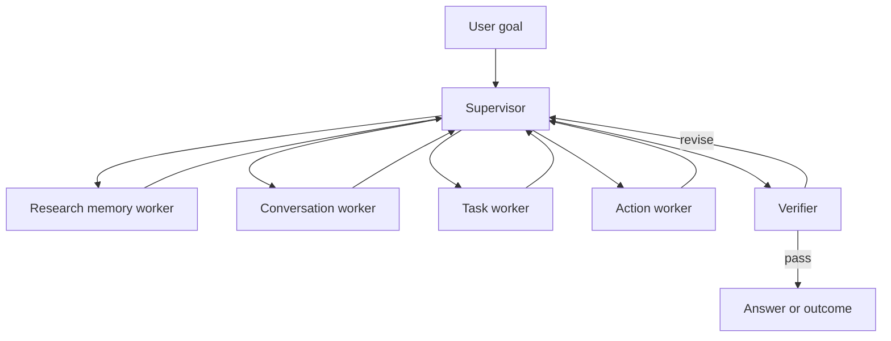

### Core loop

```text
interpret goal
→ create subtasks
→ dispatch independent workers
→ collect structured results
→ resolve conflicts
→ request approval
→ execute selected action
→ verify outcome
→ summarize
```

### Strengths

- Handles complex goals spanning messages, tasks, and apps.
- Independent workers can run concurrently.
- Supervisor can compare evidence before acting.
- Natural place for a dedicated verifier.

### Weaknesses

- Considerably more orchestration state.
- Expensive and slower on mobile.
- Workers may duplicate retrieval and reasoning.
- Requires clear task IDs, cancellation, retries, and result schemas.

### Best fit

Requests such as “find what I promised this week, identify what is overdue, draft replies, and make a plan.”

---

## Architecture D — Blackboard multi-agent system

Agents do not call each other directly. They read and write claims, tasks, evidence, and proposals to a shared workspace called a blackboard.

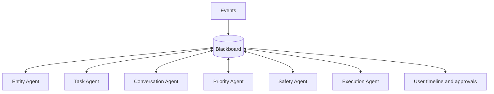

Example blackboard records:

```text
observation: Haneen asked for the PDF
entity: Haneen is a contact
candidate_task: send PDF to Haneen
evidence: WhatsApp notification at 14:32
proposal: draft a reply and locate recent PDF
risk: sending externally requires approval
status: waiting_for_user
```

### Core loop

```text
append observation
→ interested agents inspect new records
→ agents append interpretations and proposals
→ policy selects an eligible proposal
→ user approves if required
→ executor acts
→ verifier appends outcome
```

### Strengths

- Excellent auditability: every conclusion has evidence and provenance.
- Agents remain loosely coupled.
- Supports asynchronous and proactive behavior.
- Easy to explain why Wake surfaced a suggestion.

### Weaknesses

- Requires a carefully designed shared schema.
- Blackboard growth and stale claims require lifecycle rules.
- Conflicting claims need arbitration.
- More infrastructure than the current app needs for simple Q&A.

### Best fit

A proactive “second brain” that continuously derives tasks, relationships, and suggestions from an event stream.

---

## Architecture E — Event-driven reactive agents

Every captured event is published internally. Small agents subscribe to relevant event types and emit derived events.

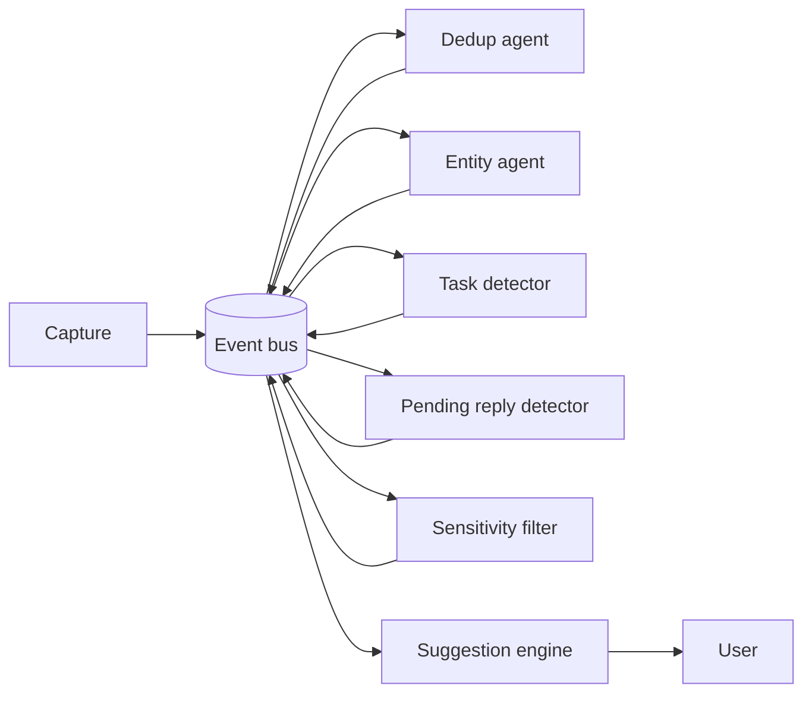

Example event progression:

```text
notification_captured
→ message_identified
→ commitment_detected
→ task_candidate_created
→ reminder_candidate_created
→ user_approval_requested
→ reminder_created
```

### Strengths

- Naturally matches Wake's continuous capture pipeline.
- Agents can operate independently and asynchronously.
- New detectors can be added without rewriting an orchestrator.
- Supports proactive features efficiently if many checks are deterministic.

### Weaknesses

- Event loops, duplicate processing, and ordering become correctness risks.
- Requires idempotency and durable processing state.
- Debugging causality can be difficult without tracing.
- Model calls on every event would be wasteful; most subscribers must be cheap filters.

### Best fit

Proactive task extraction, pending-reply detection, follow-up reminders, and activity summaries.

---

## Architecture F — Planner, executor, verifier

The reasoning process is explicitly divided into planning, execution, and verification. This is focused on reliable action rather than broad specialization.

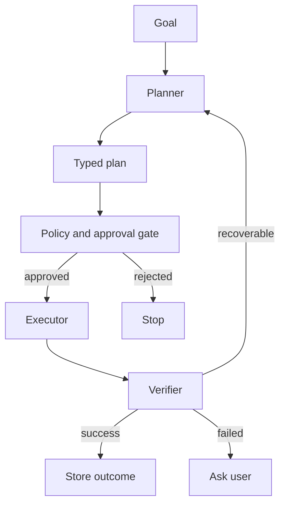

### Core loop

```text
goal
→ retrieve relevant state
→ produce typed plan
→ validate permissions and risk
→ request approval
→ execute one step
→ inspect result
→ continue, replan, or stop
```

### Strengths

- Strong safety boundary around real-world actions.
- Plans can be displayed before execution.
- Verification prevents the system from claiming success prematurely.
- Works well with deterministic Android tools.

### Weaknesses

- Excessive for pure question answering.
- Reliable UI-state verification through accessibility can be difficult.
- Replanning needs strict retry limits.
- Requires typed actions rather than free-form model output.

### Best fit

Sending messages, creating calendar entries, filling forms, and multi-step Android automation.

---

## Architecture G — Local-first split brain

A small on-device controller handles private context, routing, redaction, and approval. A cloud model is used only for difficult reasoning on explicitly selected context.

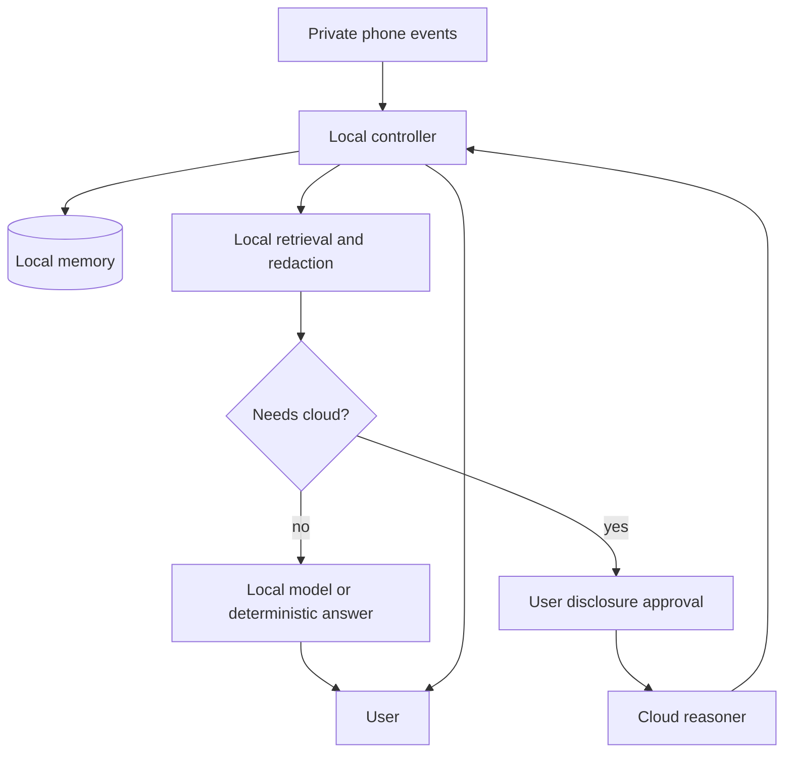

### Strengths

- Preserves a strong privacy story.
- Cloud receives only selected and possibly redacted context.
- Offline capabilities remain available.
- Model choice can depend on sensitivity, complexity, latency, and battery.

### Weaknesses

- Requires data classification and redaction quality.
- Local and cloud answers may behave differently.
- More UI is needed to explain what leaves the device.
- Small local models may be weak routers without deterministic support.

### Best fit

Wake's stated local-first identity while still allowing high-quality cloud reasoning.

---

# Memory architectures

## Memory A — Event log only

Keep every accepted capture as an immutable event and retrieve directly from it.

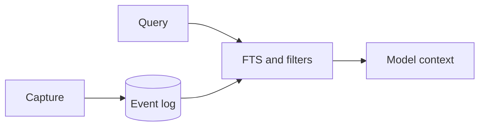

### Data shape

```text
event_id
timestamp
source
app
sender
text
session_id
content_hash
```

### Trade-offs

- Simple, auditable, and already close to Wake's Room model.
- Best for “what happened?” and exact text recall.
- Weak for long histories, aliases, evolving tasks, and semantic questions.
- Derived understanding must be recomputed repeatedly.

---

## Memory B — Event log plus episodic summaries

Preserve raw events but periodically create summaries for sessions, conversations, days, or activities.

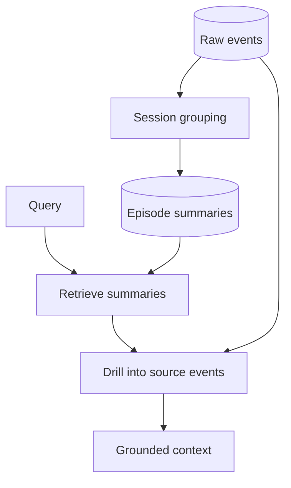

### Example episodes

- “Discussed the Wake demo with Haroon between 14:00 and 14:25.”
- “Read three pages about LiteRT-LM integration.”
- “Received two messages requesting a PDF.”

### Trade-offs

- Reduces context size while preserving source events for citations.
- Supports daily recaps and activity continuity.
- Summaries can omit important details or introduce incorrect claims.
- Every summary must keep links to its source event IDs.

---

## Memory C — Layered cognitive memory

Separate short-term activity, episodic history, semantic facts, and procedural knowledge.

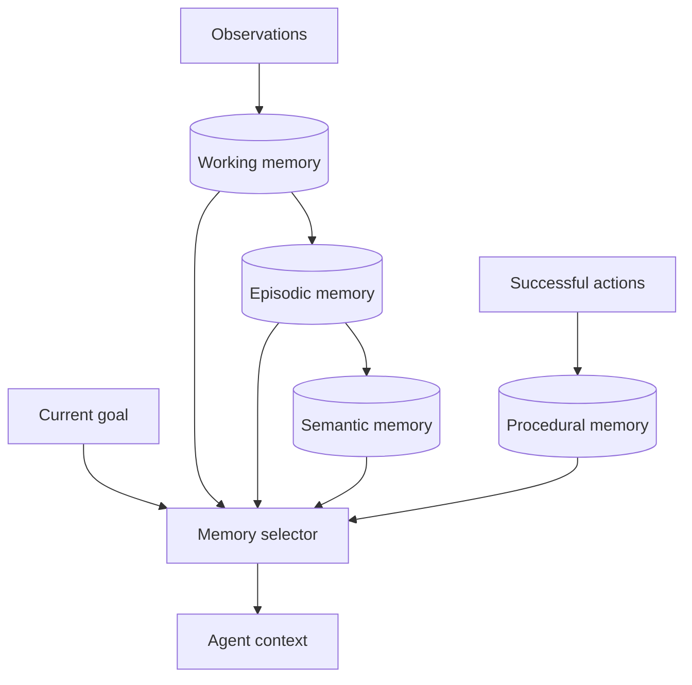

### Layers

- **Working memory:** Current app, recent screens, active user request, current plan.
- **Episodic memory:** Timestamped sessions and conversations.
- **Semantic memory:** Durable facts such as contact aliases, preferences, projects, and relationships.
- **Procedural memory:** Learned or configured ways to perform actions.

### Trade-offs

- Matches how users expect a personal assistant to remember.
- Retrieves less irrelevant raw history.
- Consolidation and contradiction handling become first-class problems.
- Semantic facts require confidence, provenance, and expiry.

---

## Memory D — Entity and relationship graph

Build a graph over people, apps, projects, documents, tasks, places, and events.

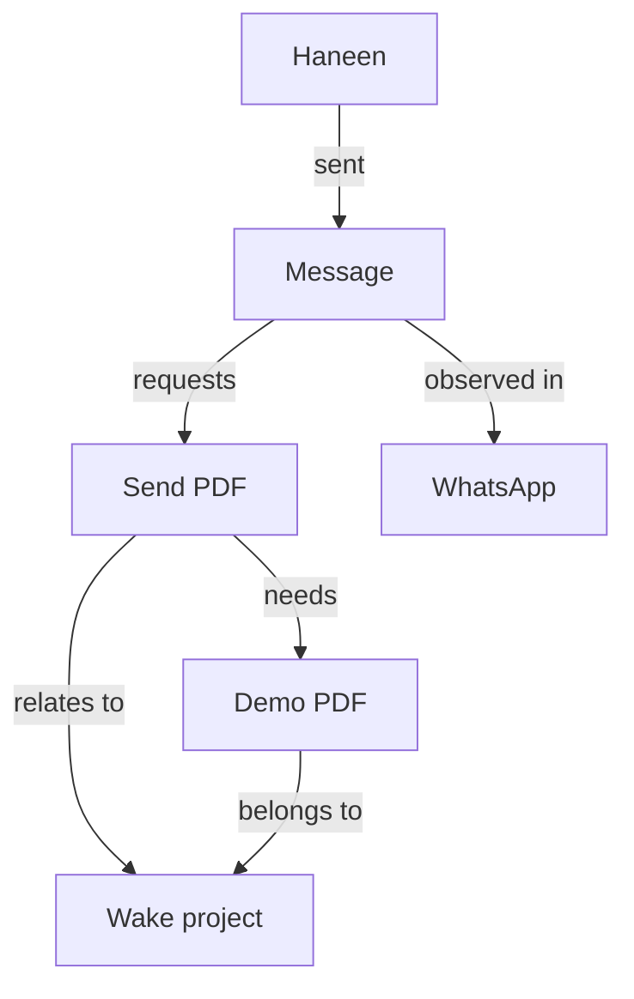

### Potential nodes

- Person
- Conversation
- Project
- Task
- Document
- App
- Place
- Event

### Potential edges

- sent
- mentioned
- requested
- belongs_to
- blocked_by
- follows_up
- occurred_in
- evidence_for

### Trade-offs

- Strong for relationship and multi-hop questions.
- Useful for finding commitments across apps and conversations.
- Entity resolution is difficult: “Haneen,” a contact ID, and a WhatsApp title may be the same person.
- A graph should complement the event log, never replace evidence.

---

## Memory E — Hybrid lexical, semantic, temporal, and structured retrieval

Store raw events once, then expose several indexes over them.

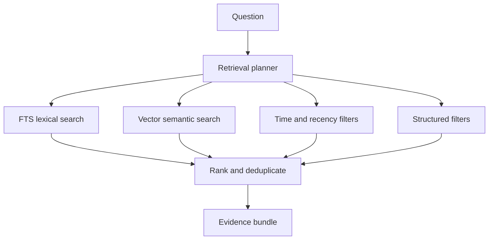

### Retrieval signals

- Exact words and names through FTS.
- Semantic similarity through embeddings.
- Recency and time expressions.
- App, sender, source, and session filters.
- Task status or entity relationships.

### Trade-offs

- Best general retrieval quality.
- Can be introduced incrementally after FTS proves the E2E loop.
- Ranking becomes harder to explain and tune.
- On-device embeddings add model, storage, indexing, and battery costs.

---

## Memory F — User-editable durable memory

The system proposes facts and preferences, but the user controls what becomes durable memory.

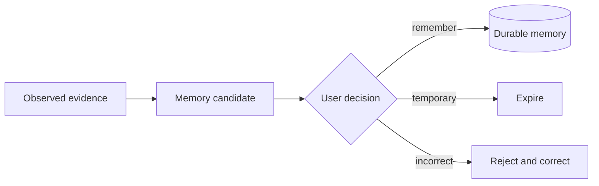

### Example candidates

- “Haneen is part of the Wake project.”
- “Prefer concise draft replies.”
- “The demo is scheduled for Friday.”

### Trade-offs

- Gives users control over a highly personal memory system.
- Reduces silent accumulation of incorrect model-generated facts.
- Confirmation prompts can become annoying.
- A confidence threshold is needed so trivial facts do not generate prompts.

---

# Core AI loop alternatives

## Loop 1 — Reactive question answering

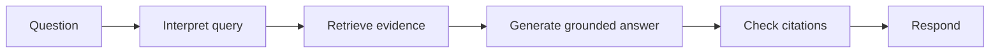

This is the safest and simplest loop. It only runs when the user asks something.

## Loop 2 — Proactive suggestion loop

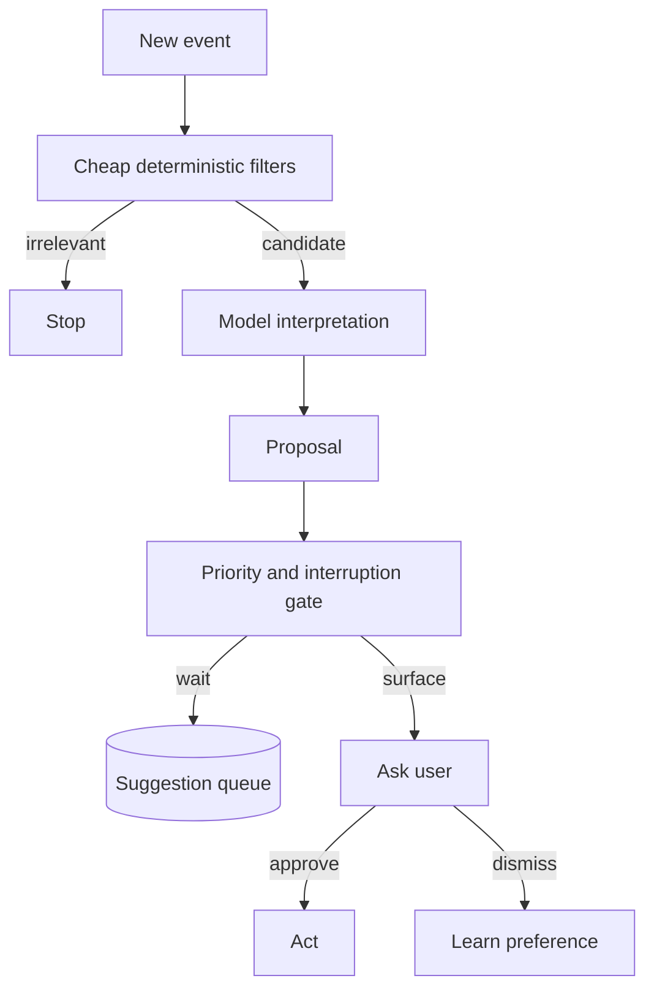

The interruption gate is essential. Detecting something useful does not mean interrupting the user immediately.

## Loop 3 — Approval-gated action loop

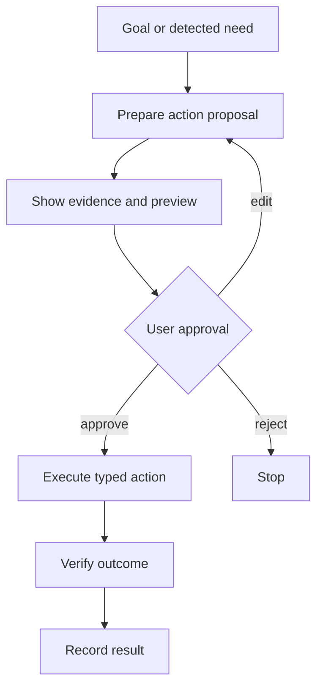

The approval should show exactly what will happen, where it will happen, and what data will leave the device.

## Loop 4 — Autonomous bounded loop

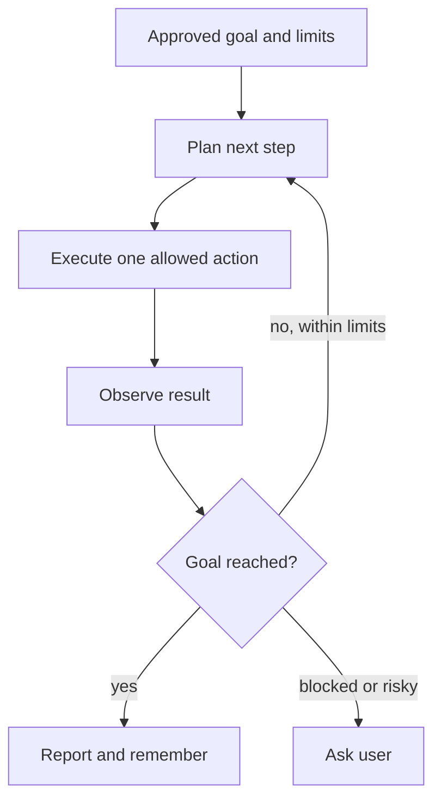

Required boundaries include maximum steps, maximum retries, allowed apps, allowed action types, time budget, data-disclosure policy, and cancellation.

## Loop 5 — Reflection and consolidation loop


This loop should run when charging, idle, or explicitly requested rather than continuously invoking a large model.

---

# Safety and control architecture

Any architecture that acts should keep policy outside the generative model.

```mermaid
flowchart TD
    A[Agent proposal] --> V[Schema validation]
    V --> P[Deterministic policy]
    P -->|read-only| E[Execute]
    P -->|external side effect| U[User approval]
    P -->|forbidden| B[Block]
    U -->|approved| E
    E --> R[Result verification]
    R --> L[(Audit log)]
```

Potential action classes:

| Class | Examples | Default policy |
|---|---|---|
| Read-only | Search memory, inspect recent events | Allow |
| Local reversible | Create a draft, set an in-app reminder | Allow or lightweight confirmation |
| External reversible | Create a calendar draft | Preview and approve |
| External communication | Send a message or email | Always approve exact content and recipient |
| Sensitive or destructive | Delete data, submit payment, change security settings | Block or require strong explicit confirmation |

The model proposes typed actions. It should never directly produce arbitrary Android commands for execution.

---

# Candidate combined systems

## Combination 1 — Lean Wake MVP

```text
Single orchestrator
+ event-log memory
+ FTS and temporal retrieval
+ reactive Q&A loop
+ approval-gated typed actions
```

### Product character

A memory assistant that answers questions and can perform a few explicit actions. Lowest complexity and fastest route from the current codebase.

## Combination 2 — Personal chief of staff

```text
Router with specialist agents
+ layered cognitive memory
+ hybrid retrieval
+ proactive suggestion loop
+ approval-gated action loop
```

### Product character

Wake understands conversations, commitments, tasks, and preferences, then surfaces useful suggestions without becoming fully autonomous.

## Combination 3 — Proactive second brain

```text
Event-driven agents
+ blackboard coordination
+ episodic summaries
+ entity graph
+ consolidation loop
+ suggestion queue
```

### Product character

Wake continuously turns raw phone activity into structured understanding. Strongest memory product, but substantially more infrastructure and model evaluation work.

## Combination 4 — Safe phone operator

```text
Supervisor and workers
+ planner/executor/verifier
+ procedural memory
+ typed Android tools
+ deterministic policy and approvals
```

### Product character

Wake completes multi-step tasks across apps. The center of gravity shifts from memory retrieval to reliable computer use and safety.

## Combination 5 — Private hybrid intelligence

```text
Local-first split brain
+ layered memory stored on-device
+ local classification and redaction
+ optional cloud specialists
+ per-request disclosure controls
```

### Product character

Wake remains private by default while selectively using cloud intelligence. This has the strongest differentiation but requires excellent transparency around data flow.

---

# Comparison matrix

| Architecture | Complexity | Latency | Cost | Auditability | Proactivity | Action reliability | Fit with current code |
|---|---:|---:|---:|---:|---:|---:|---:|
| Single orchestrator | Low | Low | Low | Medium | Low | Medium | Very high |
| Router + specialists | Medium | Medium | Medium | Medium | Medium | Medium | High |
| Supervisor + workers | High | High | High | High | Medium | High | Medium |
| Blackboard | High | Medium | Medium | Very high | Very high | High | Medium |
| Event-driven agents | High | Low to medium | Variable | High with tracing | Very high | Medium | High |
| Planner/executor/verifier | Medium to high | Medium | Medium | Very high | Medium | Very high | Medium |
| Local-first split brain | High | Variable | Variable | High | Medium | High | High |

| Memory design | Query quality | Storage cost | Model cost | Explainability | Implementation difficulty |
|---|---:|---:|---:|---:|---:|
| Event log | Medium | Low | Medium | Very high | Low |
| Episodic summaries | High | Low | Medium | High | Medium |
| Layered cognitive memory | High | Medium | Medium | Medium | High |
| Entity graph | High for relationships | Medium | Medium | High | High |
| Hybrid retrieval | Very high | Medium | Medium | Medium | High |
| User-editable memory | High trust | Low | Low | Very high | Medium |

---

# Decisions to make before implementation

## Product identity

- Is Wake primarily a searchable personal memory, a proactive assistant, or a phone-operating agent?
- Should the first compelling experience be recall, task detection, pending replies, or action execution?
- Is local-only operation a hard guarantee, a default, or merely one selectable mode?

## Autonomy

- Can Wake only answer and suggest?
- Can it prepare drafts without approval?
- Can it perform local reversible actions automatically?
- Must every external side effect receive explicit approval?

## Memory truth

- Are raw events the only source of truth?
- Can model-generated summaries become durable memory automatically?
- How are corrections, contradictions, expiry, and forgetting handled?
- Which memories may leave the phone for cloud inference?

## Agent coordination

- Does one orchestrator remain responsible for the whole request?
- Are specialists selected one at a time or allowed to collaborate?
- Is agent state ephemeral, stored as tasks, or represented on a blackboard?
- How are duplicate actions and stale proposals prevented?

## User experience

- Is proactivity delivered immediately, in a suggestion inbox, or in a daily briefing?
- How does Wake explain why it remembered or suggested something?
- Can users inspect, edit, pin, or delete derived memories?
- How is cloud disclosure made visible at the moment it happens?

---

# Architectural invariants worth preserving

These principles are useful across all choices:

1. Raw observations remain immutable evidence until retention deletes them.
2. Derived memories always link back to source event IDs.
3. Retrieval and model inference remain separate interfaces.
4. Model-generated actions are typed and schema-validated.
5. Deterministic policy, not the model, decides whether approval is required.
6. External actions are idempotent and have explicit outcome records.
7. Every autonomous loop has step, retry, time, and permission limits.
8. Sensitive data is filtered before storage and again before cloud disclosure.
9. The user can inspect and erase both raw and derived memory.
10. The system says “unknown” when evidence is insufficient.

---

# A low-regret evolutionary path

This is not a selected architecture. It is the path that preserves the most future options:

```mermaid
flowchart LR
    P1[Event log + cloud E2E] --> P2[Typed orchestrator tools]
    P2 --> P3[Episodic summaries]
    P3 --> P4[Task and conversation specialists]
    P4 --> P5[Suggestion queue]
    P5 --> P6[Planner/executor/verifier]
    P6 --> P7[Optional blackboard or entity graph]
```

- Start with the single orchestrator because it matches the current application.
- Add typed tool and result contracts before adding more agents.
- Add episodic summaries before embeddings or a graph because summaries solve context growth while preserving evidence.
- Split out a specialist only when one responsibility has distinct prompts, tools, retrieval, and evaluation criteria.
- Add proactivity through a queue before immediate interruptions.
- Add supervisor or blackboard coordination only when real workflows require multiple specialists on the same goal.

The key choice is not the number of agents. It is where state, authority, evidence, and verification live. Multiple prompts without those boundaries produce a more expensive single-agent system rather than a reliable multi-agent architecture.
